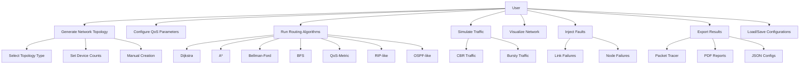
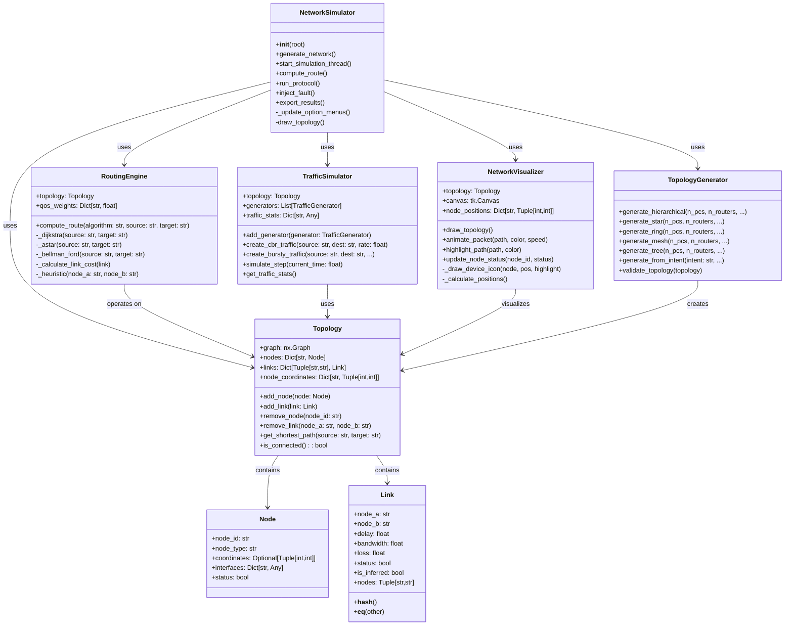
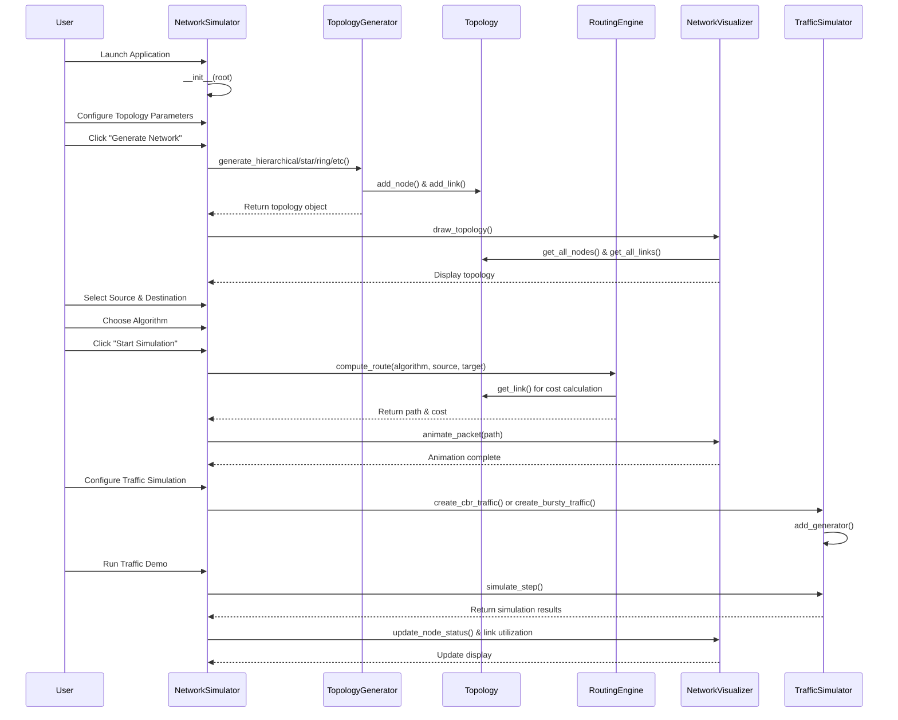
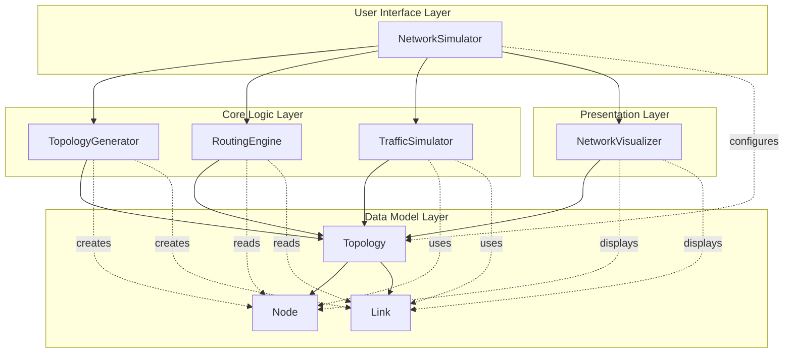
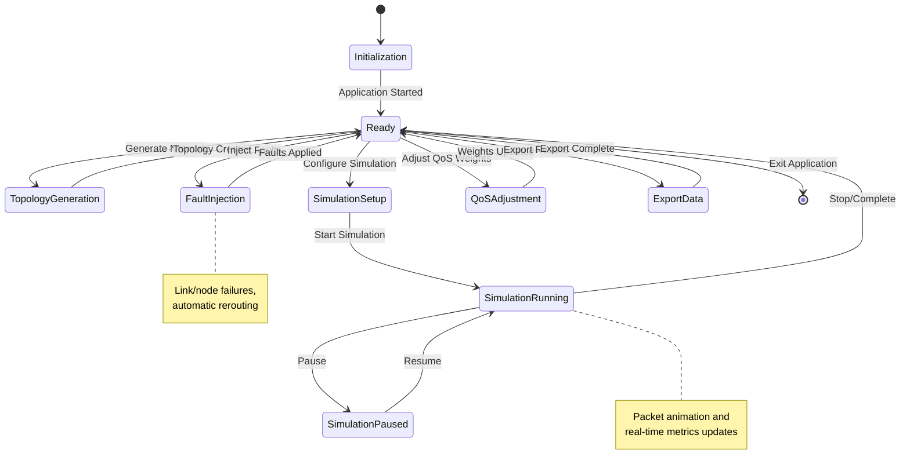
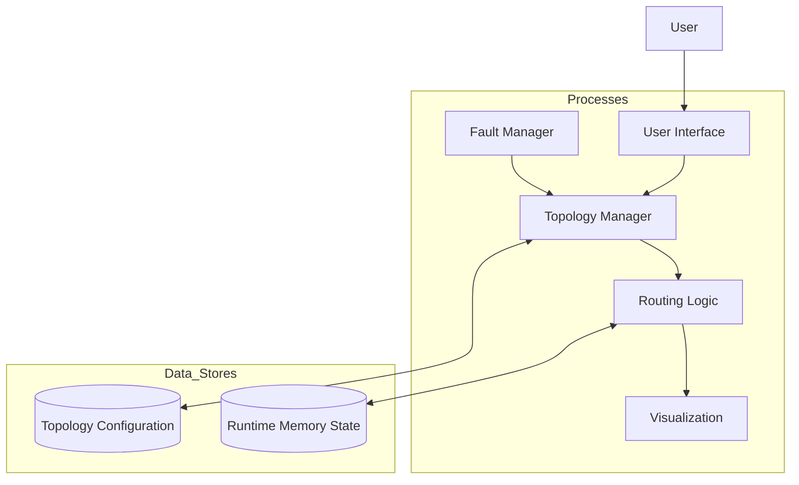
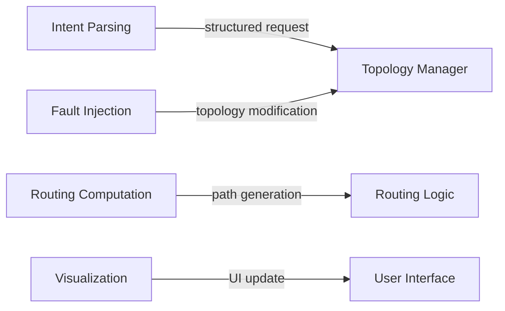

# NetTopoGen: Advanced Network Topology Generator and Simulator

[](https://www.python.org/)
[](LICENSE)
[](https://docs.python.org/3/library/tkinter.html)

NetTopoGen is a comprehensive network topology generator and simulation framework designed for educational, research, and network planning purposes. Built with Python and Tkinter, it provides an intuitive graphical interface for creating, visualizing, and analyzing network topologies with advanced routing algorithms, QoS metrics, and fault simulation capabilities.

## Features

### Topology Generation
- **Multiple Topology Types**: Hierarchical, Star, Ring, Mesh, Tree, and Intent-Based generation
- **Device Support**: PCs, Routers, Switches, Servers, Firewalls, ISPs, Access Points, Load Balancers
- **Manual Mode**: Interactive topology creation with drag-and-drop functionality
- **Configuration Import**: Load topologies from JSON and Cisco IOS configuration files

### Routing & Algorithms
- **Classic Algorithms**: Dijkstra, Bellman-Ford, A*, BFS
- **QoS-Aware Routing**: Composite cost function with adjustable weights for delay, bandwidth, and loss
- **Protocol Simulation**: RIP-like and OSPF-like routing protocols
- **Path Visualization**: Real-time path highlighting and cost calculation

### Quality of Service (QoS)
- **Dynamic QoS Weights**: Adjustable α (delay), β (bandwidth), γ (loss) parameters
- **Cost Function**: Cost = α·delay + β·(1/bandwidth) + γ·loss
- **Real-time Updates**: Instant path recalculation with QoS changes

### Traffic Simulation
- **Traffic Patterns**: Constant Bit Rate (CBR) and Bursty traffic models
- **Load Simulation**: Configurable traffic load factors
- **Packet Animation**: Visual packet flow with hop-by-hop animation
- **Performance Metrics**: Delay, loss, and throughput analysis

### Fault Simulation
- **Link Failures**: Break and restore network links
- **Node Failures**: Inject and clear node faults
- **Resilience Testing**: Analyze network behavior under failure conditions
- **Dynamic Routing**: Automatic path recalculation during faults

### Visualization & Export
- **Interactive Canvas**: Zoom, pan, and hover tooltips
- **Real-time Metrics**: Link utilization and queue visualization
- **Export Formats**: Packet Tracer packages, PDF reports, JSON configurations
- **Screenshot Support**: Save topology visualizations

## Diagrams

### Use Case Diagram



### Class Diagram



### Sequence Diagram



### Collaboration Diagram



### State Diagram



### Data Flow Diagrams

#### Level 1 - System Flow



#### Level 2 - Internal Operations



## Installation

### Prerequisites
- Python 3.7 or higher
- Node.js and npm (for React frontend)
- Required packages: `tkinter`, `matplotlib`, `networkx`, `numpy`

### Installation Steps

1. **Clone the repository**:
   ```bash
   git clone https://github.com/MouryaSagar17/nettopogen.git
   cd nettopogen
   ```

2. **Install dependencies**:
   ```bash
   pip install -r requirements.txt
   ```

3. **Run the application**:
   ```bash
   python src/main.py
   ```

### System Requirements
- **OS**: Windows 10/11, macOS, Linux
- **RAM**: 4GB minimum, 8GB recommended
- **Display**: 1280x720 minimum resolution

## Usage

### Getting Started

1. **Launch the Application**:
   ```bash
   python src/main.py
   ```

2. **Configure Topology**:
   - Select topology type from dropdown
   - Set number of devices (PCs, Routers, Switches, Servers)
   - Click "Generate Network"

3. **Run Simulations**:
   - Select source and destination nodes
   - Choose routing algorithm
   - Click "Start Simulation" to animate packet flow

### Key Interface Elements

#### Top Bar
- **Device Configuration**: Set counts for different device types
- **Topology Selection**: Choose from predefined or intent-based topologies
- **Actions**: Generate, load/save configurations

#### Control Panel (Right Side)
- **Simulation**: Configure and run packet simulations
- **Break Link**: Simulate link failures
- **Algorithm**: Select and compare routing algorithms
- **QoS Metrics**: Adjust quality of service parameters
- **Load**: Configure and run traffic simulations
- **Fail Node**: Inject node failures
- **Export**: Generate reports and export to external tools

#### Canvas (Main Area)
- **Interactive Visualization**: Drag nodes, hover for metrics
- **Zoom Controls**: Scale topology view
- **Manual Mode**: Add/remove devices and links

### Advanced Features

#### Intent-Based Generation
Enter natural language descriptions:
```
"small network with 3 PCs, 2 routers, and 1 switch"
```

#### QoS Optimization
Adjust weights to prioritize different metrics:
- **Delay-sensitive**: High α value
- **Bandwidth-sensitive**: High β value
- **Reliability-focused**: High γ value

#### Protocol Comparison
Compare RIP and OSPF behavior:
- RIP: Distance-vector, slow convergence
- OSPF: Link-state, fast convergence with QoS awareness

## Architecture

### Core Modules

```
src/
├── main.py              # Main GUI application
├── core.py              # Topology, Node, Link classes
├── topology_generation.py # Layout algorithms
├── routing_algorithms.py  # Path finding implementations
├── traffic_simulation.py  # Traffic modeling
├── evaluation_metrics.py  # Performance analysis
├── visualization.py      # Canvas rendering
├── protocols.py          # RIP/OSPF simulation
├── traffic_model.py      # CBR/Bursty generators
├── config.py             # QoS weight constants
├── simulation_config.py  # Configuration management
└── routing_engine.py     # Algorithm orchestration
```

### Class Hierarchy

- **Topology**: Main container for network elements
  - **Node**: Network devices with properties and interfaces
  - **Link**: Connections with QoS metrics
- **NetworkSimulator**: GUI application class
- **RoutingEngine**: Algorithm implementations
- **TrafficSimulator**: Load generation and analysis

### Design Patterns

- **Observer Pattern**: Real-time UI updates
- **Factory Pattern**: Topology generation
- **Strategy Pattern**: Routing algorithm selection
- **Decorator Pattern**: QoS metric composition

## Configuration

### Simulation Parameters

```python
# QoS Weights (config.py)
QOS_WEIGHTS = {
    'alpha': 1.0,  # Delay weight
    'beta': 1.0,   # Bandwidth weight
    'gamma': 1.0   # Loss weight
}
```

### Topology Limits

- **Maximum Nodes**: Limited by system memory
- **Supported Devices**: 10 device types
- **Link Metrics**: Configurable delay (1-50ms), bandwidth (10Mbps-10Gbps), loss (0-50%)

## Contributing

We welcome contributions! Please follow these steps:

1. **Fork the repository**
2. **Create a feature branch**:
   ```bash
   git checkout -b feature/your-feature-name
   ```
3. **Make your changes**
4. **Add tests** for new functionality
5. **Commit your changes**:
   ```bash
   git commit -am 'Add some feature'
   ```
6. **Push to the branch**:
   ```bash
   git push origin feature/your-feature-name
   ```
7. **Create a Pull Request**

### Development Guidelines

- Follow PEP 8 style guidelines
- Add docstrings to all functions and classes
- Write unit tests for new features
- Update documentation for API changes
- Test on multiple platforms (Windows, macOS, Linux)

### Testing

Run the test suite:
```bash
python -m pytest tests/
```

## License

This project is licensed under the MIT License - see the [LICENSE](LICENSE) file for details.

## Acknowledgments

- Built with Python's Tkinter for cross-platform GUI
- NetworkX for graph algorithms and analysis
- Matplotlib for visualization and PDF export
- Inspired by network simulation tools like Packet Tracer and GNS3

## Support

For questions, issues, or contributions:

- **GitHub Issues**: [Report bugs and request features](https://github.com/MouryaSagar17/nettopogen/issues)
- **Documentation**: [Wiki](https://github.com/MouryaSagar17/nettopogen/wiki)
- **Email**: 23695a3707@mits.ac.in

---

**NetTopoGen** - Empowering network education and research through interactive simulation.
